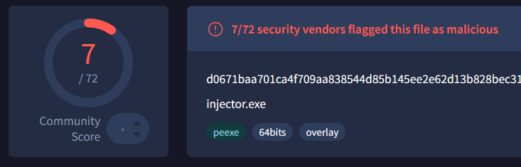

> CE PROJET EST À VOCATION PUREMENT ÉDUCATIVE. Il est nécessaire de comprendre les malwares pour pouvoir les analyser (reverser), c'est donc dans cette mentalité que j'ai décidé de créer mon propre malware de plus en plus complexe et non détectable.

📄 Voir [EULA.md](./EULA.md) pour les conditions d'utilisation.

##### Process injector level 0
les shellcodes sont obtenu avec : 
```
64 bit Shellcode : msfvenom --platform windows -p windows/x64/messagebox TEXT="Injected by Rida" TITLE="Pwned" EXITFUNC=thread -f c
32 bit shellcode : msfvenom -p windows/messagebox -a x86 --platform windows TEXT="Injected by Rida" TITLE="Pwned" EXITFUNC=thread -f c
```

POC : 


Detection: 


##### Process injector level 1
> Import dynamique et XOR des noms de fonctions et shellcodes

POC : 


Detection : 


##### Process injector level 2
> Imports dynamisque obfusqué sur plus de fonctions, detection basique de VM + Debugger
> implementation d'une techique de faire grossire le process en mémoire pour timeout les AVs

POC :


Detection : 



##### DLL injector level 0
POC : 


Detection : 
Bon ça sert a rien c'est niveau 0


