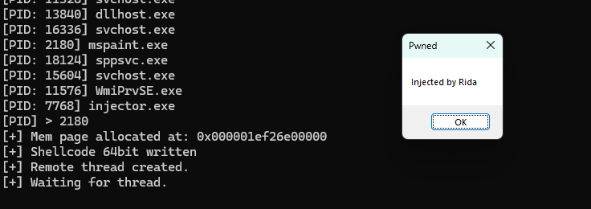

##### Un simple process injector 
> gcc .\injector.cpp -o injector.exe

les shellcodes sont obtenu avec : 
```
64 bit Shellcode : msfvenom --platform windows -p windows/x64/messagebox TEXT="Injected by Rida" TITLE="Pwned" EXITFUNC=thread -f c
32 bit shellcode : msfvenom -p windows/messagebox -a x86 --platform windows TEXT="Injected by Rida" TITLE="Pwned" EXITFUNC=thread -f c
```

POC : 

