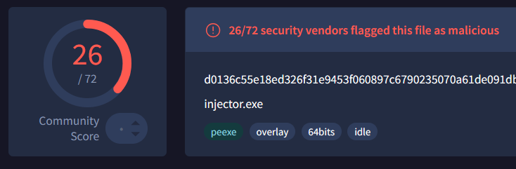
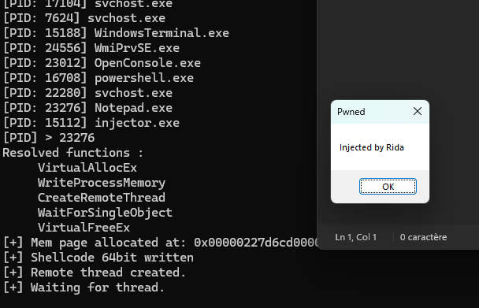
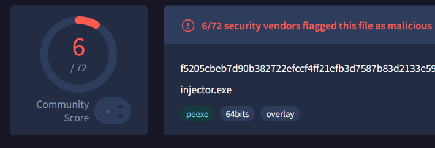

##### Process injector level 0
les shellcodes sont obtenu avec : 
```
64 bit Shellcode : msfvenom --platform windows -p windows/x64/messagebox TEXT="Injected by Rida" TITLE="Pwned" EXITFUNC=thread -f c
32 bit shellcode : msfvenom -p windows/messagebox -a x86 --platform windows TEXT="Injected by Rida" TITLE="Pwned" EXITFUNC=thread -f c
```

POC : 


Detection: 



##### Process injector level 1
> Import dynamique et XOR des noms de fonctions et shellcodes

POC : 


Detection : 

