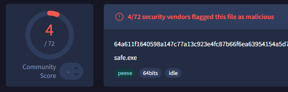

> CE PROJET EST À VOCATION PUREMENT ÉDUCATIVE. Il est nécessaire de comprendre les malwares pour pouvoir les analyser (reverser), c'est donc dans cette mentalité que j'ai décidé de créer mon propre malware de plus en plus complexe et non détectable.

📄 Voir [EULA.md](./EULA.md) pour les conditions d'utilisation.

##### Process injector level 0
Les shellcodes sont obtenus avec : 
```
64 bit Shellcode : msfvenom --platform windows -p windows/x64/messagebox TEXT="Injected by Rida" TITLE="Pwned" EXITFUNC=thread -f c
32 bit shellcode : msfvenom -p windows/messagebox -a x86 --platform windows TEXT="Injected by Rida" TITLE="Pwned" EXITFUNC=thread -f c
```

POC : 


Détection: 


##### Process injector level 1
> Import dynamique et obfuscation XOR des noms de fonctions et du shellcode

POC : 


Détection : 


##### Process injector level 2
> Imports dynamiques obfusqués étendus à d'autres fonctions, détection basique de VM et de debugger

> Implémentation d'une technique pour faire grossir le process en mémoire afin de faire timeout certains AV

POC :


Détection : 


##### Process injector level 3
> Même base que le niveau 2

> Indirect syscalls (via trampoline ntdll) avec obfuscation via instructions parasites

> Implémentation d’un GetProcAddress custom

POC : 


Détection



##### Process injector level 4
> Binary signing using Digicert/leaked certificates or Openssl 

- `openssl req -x509 -newkey rsa:4096 -keyout malkey.pem -out malcert.pem -sha256 -days 365`
- `openssl pkcs12 -inkey malkey.pem -in malcert.pem -export -out malsign.pfx`
- `signtool sign /f malsign.pfx /p <pfx-password> /t http://timestamp.digicert.com /fd sha256 injector.exe`

Détection : 


> https://www.virustotal.com/gui/file/8653538acf96b3e73028953b26c14d1921b938ffc646aea406c9911a4466b46a/detection

##### DLL injector level 0
POC : 


Détection : 
Bon ça sert a rien c'est niveau 0


